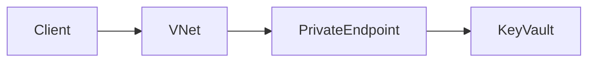

# 01_Azure_Networking_Part_003.md
Version:1.0
Questions:Q021-Q030

## Q021 What is Azure DNS?
Managed authoritative DNS hosting for public and private zones.

## Q022 Public DNS vs Private DNS
Public resolves from Internet. Private DNS resolves only within linked VNets.

## Q023 What is Private DNS Zone?
Provides internal name resolution for Private Endpoints and VNets.

## Q024 What is a Private Endpoint?
Maps an Azure PaaS service to a private IP inside your VNet.

Mermaid Diagram

Production:
AKS accesses Key Vault over Private Link without Internet.

## Q025 Private Endpoint vs Service Endpoint
Private Endpoint gives a private IP. Service Endpoint extends VNet identity to the service but service still has a public endpoint.

## Q026 What is Azure Private Link?
Technology enabling private connectivity to supported Azure PaaS and partner services.

## Q027 What is a Service Endpoint?
Secures Azure service access from selected VNets while retaining public endpoint.

## Q028 When choose Private Endpoint?
For highly regulated workloads, zero-trust, data exfiltration protection.

## Q029 Can AKS use Private Endpoints?
Yes. Common for ACR, Key Vault, Storage, SQL and Azure AI services.

## Q030 Troubleshooting Private Endpoint
1. Verify DNS resolves to private IP.
2. Check NSG/Firewall.
3. Verify endpoint approval.
4. Validate subnet policies.
5. Test with nslookup and curl.

Next Command:
NEXT_NET_004
