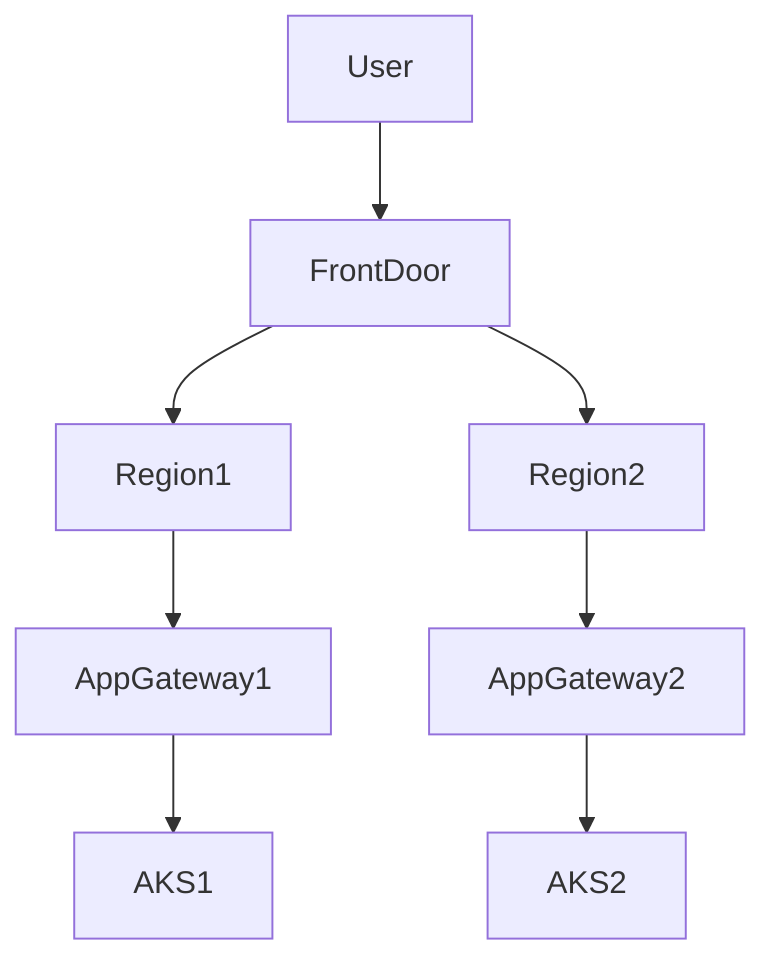

# 01_Azure_Networking_Part_005.md

Version: 1.0
Questions: Q041–Q050

## Q041 What is Azure Front Door?
Azure Front Door is a global Layer 7 entry point that provides:
- Global HTTP/HTTPS load balancing
- SSL termination
- Web Application Firewall (WAF)
- URL-based routing
- CDN acceleration
- Health probes
- Automatic failover

Best Use:
Global web applications deployed across multiple Azure regions.

---

## Q042 Azure Front Door vs Application Gateway

| Feature | Front Door | Application Gateway |
|----------|------------|---------------------|
| Scope | Global | Regional |
| Layer | L7 | L7 |
| WAF | Yes | Yes |
| CDN | Integrated | No |
| Regional Routing | No | Yes |
| Multi-region Failover | Yes | No |

Production:
Use Front Door as the global entry point and Application Gateway inside each region.

---

## Q043 What is Azure Traffic Manager?

Traffic Manager is a DNS-based global traffic distribution service.

Routing methods:
- Priority
- Weighted
- Performance
- Geographic
- MultiValue
- Subnet

---

## Q044 Front Door vs Traffic Manager

Front Door:
- HTTP/HTTPS proxy
- SSL offloading
- WAF
- Content acceleration

Traffic Manager:
- DNS only
- Protocol agnostic
- No SSL termination
- No WAF

---

## Q045 Production Architecture

Benefits

- Global failover
- Low latency
- WAF protection
- Regional isolation

---

## Q046 What is Azure NAT Gateway?

Azure NAT Gateway provides scalable outbound Internet connectivity for private resources.

Advantages

- Static outbound IP
- High scalability
- No inbound exposure
- Managed service

Typical use:
AKS nodes requiring deterministic outbound IP addresses.

---

## Q047 Why use NAT Gateway with AKS?

Without NAT Gateway:
- Outbound IPs may change.

With NAT Gateway:
- Predictable outbound IP
- Easier firewall allow-listing
- Better outbound scalability

---

## Q048 What is DDoS Protection Standard?

Provides protection against volumetric and protocol-based distributed denial-of-service attacks.

Features:
- Adaptive tuning
- Attack analytics
- Cost protection
- Integration with Azure Monitor

---

## Q049 Difference between DDoS Basic and Standard

| Feature | Basic | Standard |
|----------|-------|----------|
| Included | Yes | No |
| Adaptive Protection | No | Yes |
| Analytics | No | Yes |
| Cost Protection | No | Yes |

Recommendation:
Production internet-facing workloads should use DDoS Protection Standard.

---

## Q050 Interview Scenario

Scenario:
Users report intermittent connectivity to an application hosted in AKS behind Front Door.

Troubleshooting order:

1. Front Door backend health
2. Application Gateway health
3. WAF logs
4. AKS Ingress Controller
5. Service endpoints
6. Pod readiness
7. NSG
8. Azure Firewall
9. Route Tables
10. DNS resolution

Golden Rule:
Always troubleshoot from the client toward the workload, validating each network hop.

Next Command:
NEXT_NET_006
