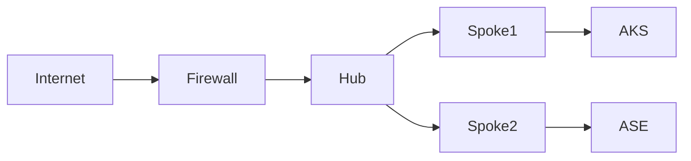

# 01_Azure_Networking_Part_006.md

Version: 1.0
Questions: Q051–Q060

---

## Q051 What is Azure Firewall?

Azure Firewall is a fully managed, stateful Layer 3–Layer 7 network security service.

Capabilities:
- Network Rules
- Application Rules
- DNAT Rules
- Threat Intelligence
- FQDN Filtering
- TLS Inspection (Premium)
- IDPS (Premium)

Production:
Place Azure Firewall in the Hub VNet to inspect all north-south and selected east-west traffic.

---

## Q052 Azure Firewall vs NSG

| Feature | NSG | Azure Firewall |
|----------|-----|----------------|
| Layer | L3/L4 | L3–L7 |
| Stateful | Yes | Yes |
| FQDN Filtering | No | Yes |
| Threat Intelligence | No | Yes |
| Centralized | Limited | Yes |
| TLS Inspection | No | Premium |

Rule of thumb:
- NSG protects subnets/NICs.
- Azure Firewall protects network boundaries.

---

## Q053 Azure Firewall Rule Types

1. Network Rules (IP, Port, Protocol)
2. Application Rules (FQDN, HTTP/HTTPS)
3. DNAT Rules (Inbound translation)

Rule processing:
DNAT → Network → Application

---

## Q054 Azure Firewall Manager

Centralized management for:
- Multiple Azure Firewalls
- Firewall Policies
- Secured Virtual Hub

Ideal for enterprises with multiple subscriptions and regions.

---

## Q055 Azure Firewall Policy

Firewall Policy allows reusable rule collections.

Benefits:
- Central governance
- Version control
- Reusable policies
- Consistent security posture

---

## Q056 Azure Firewall in Hub-Spoke

Benefits:
- Single inspection point
- Central logging
- Simplified governance

---

## Q057 Forced Tunneling

Forced tunneling routes outbound traffic through:
- Azure Firewall
- On-premises firewall
- Network Virtual Appliance (NVA)

Implemented using User Defined Routes (UDRs).

---

## Q058 Azure Firewall Premium

Premium adds:
- TLS Inspection
- IDPS
- URL Filtering
- Web Categories

Recommended for regulated industries requiring deep packet inspection.

---

## Q059 Common Azure Firewall Troubleshooting

Checklist:
1. Verify effective routes.
2. Check Firewall Policy.
3. Validate Rule Collection priorities.
4. Review Firewall logs.
5. Confirm DNS resolution.
6. Test connectivity using Azure Network Watcher.

---

## Q060 Interview Scenario

Scenario:
AKS pods cannot reach Azure Container Registry (ACR) after outbound traffic is forced through Azure Firewall.

Investigation:
1. Confirm DNS resolves ACR endpoint.
2. Check Application Rules for *.azurecr.io.
3. Validate UDR to Firewall.
4. Review Firewall logs for denies.
5. Confirm Managed Identity/RBAC is correct.
6. Test image pull from node.

Lesson:
Connectivity and authentication must both succeed for image pulls.

Next Command:
NEXT_NET_007
