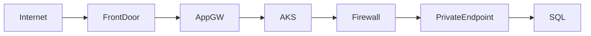

# 01_Azure_Networking_Part_007.md

Version:1.0
Questions: Q061–Q070

## Q061 What is Azure Network Watcher?
Regional diagnostic service for monitoring, troubleshooting and validating Azure network connectivity.

Features:
- Connection Monitor
- IP Flow Verify
- Next Hop
- Effective Routes
- Packet Capture
- NSG Flow Logs
- Topology

## Q062 Connection Monitor
Continuously validates connectivity and latency between Azure and on-prem endpoints.

Production: Monitor AKS node connectivity to Azure SQL Private Endpoint.

## Q063 IP Flow Verify
Determines whether a packet is allowed or denied and identifies the NSG rule responsible.

CLI:
```bash
az network watcher test-ip-flow
```

## Q064 Next Hop
Shows the route Azure selects for a destination IP.

Use after adding UDRs or Azure Firewall.

## Q065 Effective Routes
Displays the final routing table after combining system, BGP and user-defined routes.

## Q066 Packet Capture
Captures VM traffic without installing third-party tools.

Typical filters:
- IP
- Port
- Protocol

## Q067 NSG Flow Logs
Record allowed and denied traffic for NSGs. Useful for forensic analysis and traffic optimization.

## Q068 Network Topology



Use topology view to validate architecture and dependencies.

## Q069 Enterprise Troubleshooting Workflow
1. DNS
2. Route
3. NSG
4. Azure Firewall
5. Load Balancer/Application Gateway
6. Kubernetes Ingress
7. Service
8. Pod
9. Application logs

## Q070 Interview Scenario
Pods cannot reach Storage Account.
Checklist:
- Private DNS resolves privatelink endpoint.
- Effective Routes correct.
- NSG permits traffic.
- Firewall allows FQDN/IP.
- Storage firewall permits Private Endpoint.
- Validate with curl/nslookup/tcpping.

Next Command:
NEXT_NET_008
