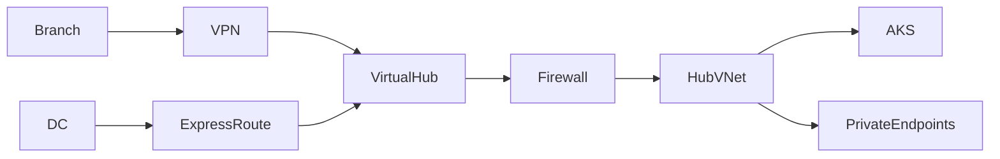

# 01_Azure_Networking_Part_008.md

Version:1.0
Questions:Q071–Q080

## Q071 What is Azure Virtual WAN?
Managed networking service that simplifies branch, remote user and Azure connectivity through Microsoft backbone.

## Q072 What is a Virtual Hub?
A Microsoft-managed hub containing VPN Gateway, ExpressRoute Gateway, Azure Firewall and routing services.

## Q073 What is Secured Virtual Hub?
A Virtual Hub integrated with Azure Firewall Manager for centralized inspection and policy enforcement.

## Q074 What is Azure Route Server?
Enables dynamic route exchange (BGP) between Azure and Network Virtual Appliances without manual UDR updates.

## Q075 What is BGP?
Border Gateway Protocol dynamically exchanges routes between autonomous systems. Used by ExpressRoute and VPN Gateway.

## Q076 What is Route Propagation?
Automatic distribution of learned routes (system/BGP) to route tables unless disabled.

## Q077 What is ExpressRoute Global Reach?
Connects on-premises sites through Microsoft's backbone using existing ExpressRoute circuits.

## Q078 What is a Network Virtual Appliance (NVA)?
A third-party virtual appliance providing firewall, IDS/IPS, SD-WAN or routing functions.

## Q079 Enterprise Hybrid Architecture

## Q080 Interview Scenario
Problem: Branch office cannot access AKS.
Troubleshooting:
1. Verify BGP advertisements.
2. Check ExpressRoute/VPN status.
3. Validate effective routes.
4. Review Azure Firewall logs.
5. Confirm NSG rules.
6. Test DNS resolution.
7. Validate AKS private endpoint reachability.

Next Command:
NEXT_NET_009
