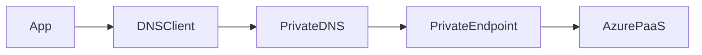

# 01_Azure_Networking_Part_009.md

Version:1.0
Questions:Q081–Q090

## Q081 What is Azure Service Tag?
Microsoft-managed group of IP prefixes representing Azure services, simplifying NSG and Firewall rules.

## Q082 Why use Service Tags?
Avoid manual IP maintenance as Azure updates service ranges automatically.

## Q083 What are Application Security Groups (Advanced)?
ASGs logically group VM NICs so NSG rules target application tiers instead of IPs.

## Q084 What are Effective Security Rules?
Combined inbound/outbound rules after evaluating subnet NSGs and NIC NSGs.

CLI:
az network nic list-effective-nsg

## Q085 What is Azure Network Verifier?
Use Network Watcher tools (IP Flow Verify, Next Hop, Effective Routes) to validate connectivity before deployment changes.

## Q086 DNS Resolution Flow

## Q087 Common DNS Failures
- Wrong Private DNS zone link
- Missing A record
- Incorrect conditional forwarder
- Firewall blocking DNS
- Stale cache

## Q088 Network Design Best Practices
- Non-overlapping CIDRs
- Least privilege NSGs
- Private Endpoints
- Central Firewall
- Hub-Spoke
- NAT Gateway for outbound

## Q089 Interview Design Question
Design a secure AKS platform with:
- Hub-Spoke
- Azure Firewall
- Private ACR
- Private Key Vault
- Application Gateway + WAF
- Private DNS
- DDoS Standard

## Q090 Troubleshooting Checklist
DNS → Routes → NSG → Firewall → Load Balancer/AppGW → Ingress → Service → Pod → Application.

Next Command:
NEXT_NET_010
