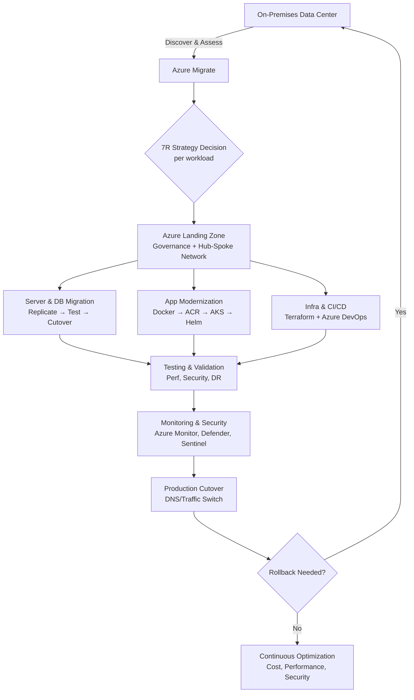
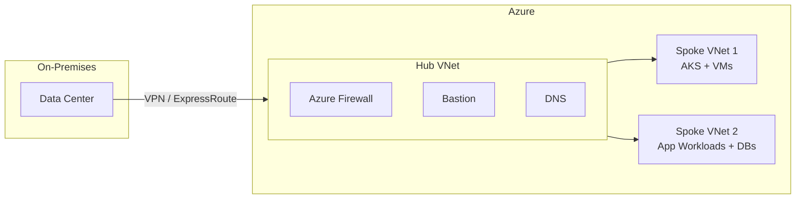

# Azure Cloud Migration Guide
### From On-Premises Data Center to a Modern Azure Platform — Interview Prep Edition

> **"Cloud migration is not simply: Move the servers → Start the VMs → Done."**
> It's a complete transformation journey involving assessment, architecture, networking, security, automation, application modernization, database migration, monitoring, and operational readiness.

This README walks through the same 11-stage migration framework shown in the reference infographic, reframed as **interview talking points**. For each section you'll find:

- **What it is** — the concept in plain terms
- **Why it matters** — the business/technical reason it exists
- **30-Second Answer** — an elevator-pitch line for rapid-fire rounds
- **Full Sample Answer** — a longer spoken answer you can adapt
- **Common Pitfalls** — what goes wrong, and how to say you'd avoid it
- **Likely Follow-ups** — probing questions and how to handle them
- **Level** — 🟢 Junior / 🟡 Mid / 🔴 Senior, so you know how deep to go

---

## Table of Contents
1. [Discovery & Assessment](#1-discovery--assessment) 🟢
2. [The 7R Migration Strategy](#2-the-7r-migration-strategy) 🟢
3. [Build the Azure Landing Zone](#3-build-the-azure-landing-zone) 🟡
4. [Network & Connectivity](#4-network--connectivity) 🟡
5. [Server Migration](#5-server-migration) 🟢
6. [Application Modernization](#6-application-modernization) 🟡
7. [Database Migration](#7-database-migration) 🟡
8. [Security & Governance](#8-security--governance) 🔴
9. [Infrastructure & CI/CD Automation](#9-infrastructure--cicd-automation) 🔴
10. [Monitoring & Observability](#10-monitoring--observability) 🟡
11. [Testing & Production Cutover](#11-testing--production-cutover) 🔴
12. [The Complete Enterprise Migration Flow](#12-the-complete-enterprise-migration-flow) 🔴
13. [The Real Role of a DevOps Engineer](#13-the-real-role-of-a-devops-engineer) 🔴
14. [Architecture Diagram](#14-architecture-diagram)
15. [STAR Story Bank](#15-star-story-bank)
16. [Glossary](#16-glossary)
17. [Quick-Reference Cheat Sheet](#17-quick-reference-cheat-sheet)

---

## 1. Discovery & Assessment 🟢

**What it is:** A full inventory of the on-prem estate — servers, OS versions, CPU/memory/storage utilization, applications, databases, network topology, and inter-application dependencies — built using **Azure Migrate**, which also outputs right-sizing recommendations and estimated Azure cost.

**Why it matters:** You can't plan a migration strategy, a landing zone, or a budget without a baseline. Skipping this is the #1 cause of failed or over-budget migrations.

**30-Second Answer:**
"Discovery is where I use Azure Migrate to inventory every server, app, and dependency, and get real utilization data — so every decision after this point is based on facts, not assumptions."

**Full Sample Answer:**
"Before we touch anything, I run a discovery phase using Azure Migrate to catalog every server, its OS, real utilization — not just allocated capacity — the applications running on it, and critically, the dependencies between applications. This dependency mapping tells me which workloads have to move together. I also use this phase to generate right-sizing recommendations, because on-prem servers are almost always over-provisioned, and to get a realistic cost estimate I can take to stakeholders."

**Common Pitfalls:**
- Sizing based on *allocated* capacity instead of *actual* utilization → over-provisioning (and overpaying) in Azure.
- Taking a single-day snapshot instead of collecting metrics over 30+ days, missing peak-load patterns.
- Missing undocumented dependencies (e.g., a legacy app calling a database no one remembers exists), causing a "big bang" migration to break silently.

**Likely Follow-ups:**
- "How do you discover undocumented dependencies?" → Azure Migrate's agent-based dependency visualization, plus interviews with app owners.
- "What if utilization data is only a snapshot?" → Recommend a 30+ day collection window before right-sizing.

---

## 2. The 7R Migration Strategy 🟢

**What it is:** Seven decision paths for each application:

| # | Strategy | Meaning | Example |
|---|----------|---------|---------|
| 1 | **Rehost** | Lift & shift, minimal changes | On-Prem VM → Azure VM |
| 2 | **Replatform** | Lift, tinker & shift — use managed services | SQL Server → Azure SQL |
| 3 | **Refactor** | Modify for cloud-native | Monolith → Microservices on AKS |
| 4 | **Rearchitect** | Redesign for scalable cloud-native | 3-Tier App → Microservices + API Gateway + Managed DB |
| 5 | **Repurchase** | Drop & shop, replace with SaaS | Self-hosted Email → Microsoft 365 |
| 6 | **Retire** | Decommission unused workloads | Reduced cost & attack surface |
| 7 | **Retain** | Keep as-is | Compliance, dependencies, cost, business constraints |

**Why it matters:** Lift-and-shift everything is fast but leaves value on the table; rearchitecting everything is slow and expensive. The 7Rs let you triage a large portfolio efficiently.

**30-Second Answer:**
"Not every app deserves the same treatment. I classify each one against the 7Rs — retire and repurchase first for fastest ROI, rehost for speed, and reserve refactor/rearchitect for the business-critical apps that actually justify the investment."

**Full Sample Answer:**
"Once discovery is done, I classify every application against the 7Rs. Low-risk, low-complexity workloads get rehosted quickly to get out of the data center on schedule. Anything using SQL Server or similar, I typically replatform onto managed services like Azure SQL to cut operational overhead. Business-critical, high-change-velocity apps are candidates for refactor or rearchitect — for example, breaking a monolith into microservices on AKS. I always check for retire and repurchase opportunities first, because those give the fastest ROI with zero migration effort."

**Common Pitfalls:**
- Defaulting every workload to "rehost" and never revisiting it → technical debt just moves to the cloud.
- Rearchitecting low-value apps that should have been retired — wasted engineering effort.
- Ignoring licensing/compliance constraints that force a "Retain" decision.

**Likely Follow-ups:**
- "How do you decide between Refactor and Rearchitect?" → Refactor = code-level changes to fit cloud-native patterns; Rearchitect = full architectural redesign.
- "What's your default strategy for a large portfolio?" → Rehost first for velocity, then optimize post-migration ("migrate then modernize").

---

## 3. Build the Azure Landing Zone 🟡

**What it is:** The governed, secure foundation built **before** any production workload moves in.

- **Governance:** Management Groups → Subscriptions → Resource Groups → Azure Policy → RBAC
- **Networking:** Hub-Spoke architecture — Hub VNet centralizes shared services (Firewall, Bastion, VPN/ExpressRoute, DNS); Spoke VNets isolate workloads (AKS, VMs, workloads, databases)

**Why it matters:** Migrating into an ungoverned subscription creates sprawl, inconsistent security, and unmanageable cost.

**30-Second Answer:**
"The landing zone is the guardrails-and-network foundation I build before anything migrates — governance through Management Groups, Policy, and RBAC, and a hub-spoke network for centralized connectivity with workload isolation."

**Full Sample Answer:**
"Landing zone always comes before migration, not after — it's the foundation everything else sits on. On governance, I set up Management Groups to group subscriptions by environment or business unit, apply Azure Policy for guardrails, and use RBAC for least-privilege access. On networking, I use a hub-spoke topology: the hub holds shared services like the Azure Firewall, Bastion for secure admin access, and the VPN/ExpressRoute connection back to on-prem, while each spoke isolates a workload — one for AKS, one for VMs, one for databases."

**Common Pitfalls:**
- Skipping the landing zone and migrating straight into a single flat subscription — has to be re-architected later at much higher cost.
- Overly permissive RBAC assignments "to move fast" that never get tightened up.
- No naming/tagging convention enforced by Policy → unmanageable cost allocation later.

**Likely Follow-ups:**
- "Why hub-spoke instead of a flat network?" → Centralizes security/inspection, reduces peering complexity, enforces workload isolation.
- "What's the role of Azure Policy here?" → Enforces compliance automatically (allowed regions, required tags, mandatory encryption).

---

## 4. Network & Connectivity 🟡

**What it is:** Secure connectivity between on-prem and Azure: IP planning, VNet/subnet design, NSGs, route tables, Azure Firewall, VPN or ExpressRoute, DNS, and Private Endpoints. On-prem connects via VPN/ExpressRoute into the Hub VNet, which connects to Spoke VNet 1 and Spoke VNet 2.

**Why it matters:** Get this wrong and workloads are unreachable — or worse, exposed to the internet. It also caps your migration throughput.

**30-Second Answer:**
"I plan non-overlapping IP ranges first, then connect on-prem to the hub via ExpressRoute or VPN, and use Private Endpoints so PaaS services are never exposed to the public internet."

**Full Sample Answer:**
"I start with IP planning to avoid overlapping address spaces between on-prem and Azure — a classic mistake that blocks connectivity later. Then I design VNets and subnets to match the landing zone's hub-spoke model, use NSGs and route tables to control traffic flow, and put Azure Firewall in the hub for centralized inspection. For the on-prem link, I choose ExpressRoute for production-grade, low-latency, SLA-backed connectivity, or Site-to-Site VPN for smaller or faster-to-provision scenarios. I also use Private Endpoints so PaaS services like Azure SQL aren't exposed over the public internet."

**Common Pitfalls:**
- Overlapping IP address space between on-prem and Azure VNets, discovered only during connectivity setup.
- Relying solely on public endpoints for PaaS services instead of Private Endpoints.
- Undersizing the VPN/ExpressRoute link for the actual data replication volume needed during migration.

**Likely Follow-ups:**
- "VPN vs ExpressRoute — how do you choose?" → ExpressRoute: private, predictable latency, higher bandwidth, SLA; VPN: faster to set up, cheaper, good for smaller workloads or as backup.
- "How do you secure DNS resolution between on-prem and Azure?" → Azure Private DNS zones + conditional forwarders.

---

## 5. Server Migration 🟢

**What it is:** The VM lift-and-shift execution flow:
`On-Prem VM → Azure Migrate → Replication → Test Migration → Application Validation → Cutover → Azure VM`
Test migration validates the workload in isolation **without impacting production**.

**Why it matters:** This is the repeatable pipeline that scales migration across hundreds of VMs while minimizing risk and downtime.

**30-Second Answer:**
"Azure Migrate continuously replicates each VM, we test-migrate into an isolated copy to validate without touching production, then cut over with a final delta sync."

**Full Sample Answer:**
"For rehost candidates, I use Azure Migrate's replication engine to continuously replicate the on-prem VM's disks to Azure. Before cutover, I always run a test migration into an isolated network — a disposable, non-production copy the application team can validate against. Once validation passes, I schedule the real cutover, which does a final delta sync and switches traffic over, resulting in a running Azure VM."

**Common Pitfalls:**
- Skipping test migration to save time — issues surface for the first time in production.
- Underestimating replication time for large disks, blowing the migration window.
- Not validating application-level functionality (only checking "the VM boots").

**Likely Follow-ups:**
- "How do you minimize downtime during cutover?" → Continuous replication + delta-sync at cutover means only a short final sync window.
- "What's your rollback plan if validation fails?" → Test migration is disposable and doesn't affect the source VM, so you iterate freely before committing.

---

## 6. Application Modernization 🟡

**What it is:** Moving legacy apps from monolithic, VM-hosted deployments to containerized, cloud-native platforms:
`Traditional Java App (Tomcat + WAR) → Docker Image → Azure Container Registry → AKS → Helm → Production`

**Why it matters:** Containerization improves scalability and deployment consistency, and is a prerequisite for real CI/CD automation.

**30-Second Answer:**
"I containerize the legacy app into a Docker image, store it in ACR, and deploy to AKS via Helm charts so the same definition works across dev, test, and prod."

**Full Sample Answer:**
"For a legacy Java app running as a WAR file on Tomcat, the modernization path is to containerize it into a Docker image, push it to Azure Container Registry for secure, versioned storage, and deploy it to AKS. I use Helm charts to templatize the Kubernetes manifests so the same deployment definition works across dev, test, and production with different values files. This gets the app onto a platform that can autoscale, self-heal, and integrate with CI/CD, instead of living on a static VM."

**Common Pitfalls:**
- Containerizing an app without addressing hardcoded configs/file paths that assume a static VM environment.
- Treating stateful components (local file storage, in-memory sessions) as if they're stateless once containerized.
- No image vulnerability scanning before pushing to ACR.

**Likely Follow-ups:**
- "Why ACR instead of Docker Hub?" → Private, integrated with Azure AD/RBAC, geo-replication, vulnerability scanning, tighter AKS integration.
- "How do you handle stateful legacy apps in containers?" → Persistent Volumes / Azure Files or Disks, or keep truly stateful pieces external (e.g., database stays outside the cluster).

---

## 7. Database Migration 🟡

**What it is:** A separate migration path for data due to consistency requirements:
`SQL Server On-Premises → Azure Database Migration Service (DMS) → Azure SQL`, with schema migration, data migration, validation, performance testing, final synchronization, and cutover.

**Why it matters:** Data is the highest-risk asset in any migration — loss or corruption has direct business impact.

**30-Second Answer:**
"I use Azure DMS for schema and data migration with continuous sync to the target, validate integrity while the source is still live, and cut over after a final delta sync."

**Full Sample Answer:**
"Database migration gets its own workstream because the tolerance for data loss or corruption is effectively zero. I use Azure Database Migration Service to handle both schema and data migration from on-prem SQL Server into Azure SQL. After the initial load, DMS keeps the target in sync via continuous replication, so I can run validation and performance testing against the target while the source is still live. Cutover happens after a final synchronization to catch any last-minute deltas, keeping the actual downtime window minimal."

**Common Pitfalls:**
- Not testing performance against the target's actual SKU/tier before cutover — surprises under production load.
- Skipping data validation (row counts, checksums) and assuming replication was 100% accurate.
- Forgetting to migrate SQL Agent jobs, linked servers, or other non-data dependencies.

**Likely Follow-ups:**
- "How do you validate data integrity post-migration?" → Row counts, checksums, targeted query-result comparisons between source and target.
- "How do you minimize cutover downtime?" → Continuous sync via DMS + a short final delta sync at cutover.

---

## 8. Security & Governance 🔴

**What it is:** Security applied by design, not bolted on: **Entra ID** (identity), **RBAC** (access control), **Key Vault** (secrets), **NSG** (network security), **Azure Firewall**, **Private Endpoints**, **Defender for Cloud** (threat protection), **Sentinel** (SIEM/threat detection), **Azure Policy** (compliance).

**Why it matters:** Retrofitting security after go-live is expensive and risky. Building it into every stage keeps the environment compliant and defensible from day one.

**30-Second Answer:**
"Security is shift-left in a migration — identity via Entra ID and least-privilege RBAC, secrets in Key Vault, network controls via NSG/Firewall/Private Endpoints, and continuous posture management through Defender for Cloud and Sentinel."

**Full Sample Answer:**
"Security has to be shift-left in a migration — designed in from the landing zone stage, not added after go-live. Identity is the new perimeter, so everything starts with Entra ID and least-privilege RBAC. Secrets and connection strings go into Key Vault, never in config files or code. Network-level, I use NSGs, Azure Firewall, and Private Endpoints to minimize public exposure. For ongoing posture, Defender for Cloud gives continuous security recommendations and threat protection, and Sentinel acts as the SIEM layer for detection and response. Azure Policy enforces guardrails automatically, so non-compliant resources can't even be deployed."

**Common Pitfalls:**
- Hardcoding secrets in pipeline YAML or application config instead of pulling from Key Vault at runtime.
- Granting broad "Owner" or "Contributor" roles for convenience during migration and never revoking them.
- Treating Defender/Sentinel as "set and forget" instead of tuning alerts and reviewing findings regularly.

**Likely Follow-ups:**
- "How do you handle secrets in CI/CD pipelines?" → Pipeline managed identity/service principal pulls secrets from Key Vault at runtime — never hardcoded.
- "Defender for Cloud vs Sentinel?" → Defender = CSPM + workload protection; Sentinel = SIEM/SOAR for log aggregation, detection, and incident response.

---

## 9. Infrastructure & CI/CD Automation 🔴

**What it is:** Two automation layers:
- **Infrastructure:** Terraform provisions Azure resources (IaC).
- **Application:** Developer → Git repo → Azure DevOps → Docker Build → ACR → AKS → Production, with Helm templating.

**Why it matters:** Manual provisioning doesn't scale, isn't repeatable, and isn't auditable. Automation enables reproducible environments and fast, safe releases.

**30-Second Answer:**
"Everything's code — Terraform for infrastructure, and a Git-to-AKS pipeline through Azure DevOps for applications — so every environment and deployment is reproducible and traceable to a commit."

**Full Sample Answer:**
"I treat infrastructure as code from the start — Terraform defines every Azure resource, so environments are reproducible and changes are peer-reviewed through pull requests just like application code. On the application side, the pipeline is: a developer pushes to a Git repo, Azure DevOps builds a Docker image, pushes it to ACR, and deploys it to AKS using Helm charts. Every deployment follows the same automated path — no manual click-ops in production, and every change is traceable back to a commit."

**Common Pitfalls:**
- Manual changes made directly in the Azure Portal that cause Terraform state drift.
- No PR review gate on infrastructure changes — treating IaC as "just a script" instead of production code.
- Baking secrets into Terraform variables files instead of pulling from Key Vault.

**Likely Follow-ups:**
- "Why Terraform over ARM/Bicep?" → Cloud-agnostic, mature state management, large module ecosystem — though Bicep is a valid Azure-native alternative depending on org standards.
- "How do you handle drift?" → Regular `terraform plan` checks in CI, plus RBAC/Policy locking down manual portal changes.

---

## 10. Monitoring & Observability 🟡

**What it is:** Continuous post-migration visibility via **Azure Monitor**, **Log Analytics**, **Application Insights**, **Prometheus**, and **Grafana**. Monitored: CPU/memory, application errors, database performance, infrastructure health, security events, alerts.

**Why it matters:** Migration doesn't end at cutover — you need to prove the new environment is stable and catch issues before users do.

**30-Second Answer:**
"Azure Monitor and App Insights cover native telemetry, and for Kubernetes I often layer in Prometheus and Grafana — all backed by alerts tuned to actually matter, not noise."

**Full Sample Answer:**
"Post-migration, Azure Monitor and Log Analytics are the backbone — collecting metrics and logs across VMs, AKS, and PaaS services. Application Insights gives me application-level telemetry — error rates, response times, dependency call performance. For Kubernetes workloads specifically, I often layer in Prometheus for metrics collection and Grafana for dashboards. On top of that, I configure alerts on what matters — CPU/memory thresholds, error spikes, database performance degradation, and security events — so the team is proactively notified instead of finding out from a user complaint."

**Common Pitfalls:**
- Enabling monitoring tools but never configuring meaningful alert thresholds — dashboards nobody looks at.
- Alert fatigue from overly sensitive thresholds, causing real incidents to get ignored.
- Not correlating infrastructure metrics with application-level telemetry when troubleshooting.

**Likely Follow-ups:**
- "Azure Monitor vs Prometheus/Grafana — when do you use which?" → Azure Monitor/App Insights for native Azure PaaS + app telemetry; Prometheus/Grafana for Kubernetes-native metrics and portable, open-source dashboards.
- "How do you avoid alert fatigue?" → Tune thresholds, use severity tiers, route only actionable alerts to on-call.

---

## 11. Testing & Production Cutover 🔴

**What it is:** The gate before going live: test migration, application testing, performance testing, security testing, backup/DR testing, final data sync, DNS/traffic change, production validation — backed by a **Rollback Strategy** to revert to the previous environment if migration fails.

**Why it matters:** The last checkpoint before real users are affected. A rehearsed rollback plan turns a potential outage into a manageable event.

**30-Second Answer:**
"I run a full test checklist — functional, performance, security, DR — then do a final sync and DNS cutover, with a pre-agreed rollback plan in case anything fails."

**Full Sample Answer:**
"Before any production cutover, I run through a full checklist: functional/application testing, performance testing under realistic load, security testing, and a backup/DR test to confirm we can actually recover if needed. Right before go-live, I do a final data sync, then switch DNS or traffic routing to Azure, and finish with production validation. Critically, I always have a rollback strategy defined in advance — if something goes wrong, we can revert traffic back to the previous environment quickly, rather than improvising a fix live in production."

**Common Pitfalls:**
- No pre-agreed go/no-go criteria — the rollback decision gets made emotionally, under pressure, live.
- DR/backup "tested" only on paper, never actually rehearsed.
- Cutting over all workloads at once instead of a phased/wave-based approach.

**Likely Follow-ups:**
- "What triggers a rollback, and who decides?" → Pre-agreed go/no-go criteria (e.g., error rate threshold, failed smoke tests) and a named decision owner, agreed before cutover.
- "How do you test DR without disrupting production?" → Isolated test environments and scheduled DR drills, not the live production path.

---

## 12. The Complete Enterprise Migration Flow 🔴

See the [Architecture Diagram](#14-architecture-diagram) below for the visual version.

**30-Second Answer:**
"Discovery feeds the 7R decision, which feeds the landing zone, which everything else builds on — migration, modernization, and automation happen in parallel, all gated by testing and monitoring before cutover, then it's continuous optimization."

**Full Sample Answer:**
"End to end: we start with discovery and assessment using Azure Migrate against the on-prem data center. That feeds into the 7R decision for each workload. Before anything moves, we stand up the Azure landing zone — governance plus the hub-spoke network and security baseline. Then migration executes in parallel tracks — server/app and database migration on one side, containerization and modernization via Docker/ACR/AKS on the other, all underpinned by Terraform and Azure DevOps automation. Everything goes through testing and validation, backed by monitoring, security, and DR readiness, before the production cutover. And it doesn't stop there — post-migration is continuous optimization of cost, performance, and security."

**Why this section matters in interviews:** Being able to narrate the whole flow in one breath shows you understand migration as a **system**, not a checklist — how discovery feeds strategy, strategy feeds the landing zone, and everything downstream depends on the foundation.

---

## 13. The Real Role of a DevOps Engineer 🔴

**What it is:** DevOps in a migration spans the entire journey: Assessment → Infrastructure → Networking → Automation → Application Modernization → Security → CI/CD → Monitoring → Operations.

**Key takeaway:**
> "Cloud migration is not a server-move project. It is an architecture, automation, security, and operational transformation. The best strategy is not 'Move everything to Azure.' It is: understand every workload, choose the right strategy, build the right foundation, migrate safely, modernize where it makes sense, and continuously optimize."

**30-Second Answer:**
"DevOps in a migration isn't just the CI/CD pipeline at the end — it spans assessment, infrastructure, networking, security, and operations, start to finish."

**Full Sample Answer:**
"A lot of people think DevOps in a migration just means writing the CI/CD pipeline at the end. In reality, it spans the whole lifecycle — I'm involved from assessment, through building the infrastructure and network foundation, into automating deployments, modernizing applications, embedding security, and finally into monitoring and day-2 operations. The mindset I bring is: migration isn't a lift-and-shift event, it's an ongoing architecture, automation, and operational transformation. Not every workload needs to move, and not everything that moves needs to modernize on day one — the goal is the right strategy per workload, a solid foundation, a safe migration, and continuous optimization afterward."

**Likely Follow-ups:**
- "How do you prioritize what to modernize first?" → Business criticality + change frequency + technical debt — high-change, high-value apps modernize first.
- "What does 'continuous optimization' look like in practice?" → Ongoing cost reviews (right-sizing, reserved instances), performance tuning, security posture reviews — not a one-time task.

---

## 14. Architecture Diagram

---

## 15. STAR Story Bank

Use these as skeletons — replace the bracketed details with specifics from your own project.

**Story 1 — Discovery uncovered a hidden dependency (Section 1 & 5)**
- **Situation:** During discovery for a [X-server] estate, Azure Migrate's dependency mapping showed an "unused" reporting server was actually being called by a finance batch job monthly.
- **Task:** Avoid breaking the finance process during migration.
- **Action:** Flagged the dependency, grouped both servers into the same migration wave, and coordinated the cutover window with the finance team's batch schedule.
- **Result:** Zero disruption to the finance job; the dependency became a standing check in every subsequent wave's discovery review.

**Story 2 — Rollback plan saved a cutover (Section 11)**
- **Situation:** During a production cutover for [an application], post-cutover smoke tests showed elevated error rates against the pre-agreed threshold.
- **Task:** Decide fast, without guessing, whether to proceed or roll back.
- **Action:** Used the pre-agreed go/no-go criteria to trigger the rollback plan, reverting DNS/traffic to the on-prem environment within [X minutes].
- **Result:** User impact was contained to a short window; root cause (a missed connection string change) was fixed and cutover succeeded on the next attempt.

**Story 3 — Modernization paid off post-migration (Section 6)**
- **Situation:** A legacy Java monolith was rehosted first to meet a data-center exit deadline, then selected for containerization afterward.
- **Task:** Reduce operational overhead and enable autoscaling for a workload with unpredictable traffic spikes.
- **Action:** Containerized the app (Docker → ACR → AKS → Helm) and set up autoscaling rules based on CPU/queue depth.
- **Result:** Handled traffic spikes without manual intervention and cut idle-time infrastructure cost by [X%].

---

## 16. Glossary

| Term | Meaning |
|---|---|
| **RBAC** | Role-Based Access Control — assigns permissions based on job role, not individual identity |
| **NSG** | Network Security Group — stateful firewall rules applied to subnets/NICs |
| **DMS** | (Azure) Database Migration Service — automates schema + data migration with minimal downtime |
| **IaC** | Infrastructure as Code — infrastructure defined and versioned in code (e.g., Terraform) |
| **SIEM/SOAR** | Security Information & Event Management / Security Orchestration, Automation & Response — Sentinel's category |
| **CSPM** | Cloud Security Posture Management — continuous compliance/config checks (Defender for Cloud) |
| **VNet** | Virtual Network — Azure's isolated private network construct |
| **ACR** | Azure Container Registry — private Docker image registry |
| **AKS** | Azure Kubernetes Service — managed Kubernetes |
| **Helm** | Package manager/templating tool for Kubernetes manifests |
| **ExpressRoute** | Private, dedicated network connection between on-prem and Azure |
| **Private Endpoint** | Brings a PaaS service's connectivity inside your VNet, avoiding public exposure |

---

## 17. Quick-Reference Cheat Sheet

| Stage | Primary Tool(s) | One-line Purpose |
|---|---|---|
| Discovery & Assessment | Azure Migrate | Know what you have and what it costs |
| 7R Strategy | — (decision framework) | Right migration path per workload |
| Landing Zone | Mgmt Groups, Policy, RBAC, Hub-Spoke VNets | Governed, secure foundation |
| Network & Connectivity | VPN/ExpressRoute, NSG, Firewall, Private Endpoints | Secure link between on-prem and Azure |
| Server Migration | Azure Migrate (replication) | VM lift-and-shift with test-before-cutover |
| App Modernization | Docker, ACR, AKS, Helm | Containerize legacy apps |
| Database Migration | Azure Database Migration Service | Safe, validated data move |
| Security & Governance | Entra ID, Key Vault, Defender, Sentinel, Policy | Security by design |
| Infra & CI/CD | Terraform, Azure DevOps | Repeatable, automated delivery |
| Monitoring | Azure Monitor, App Insights, Prometheus, Grafana | Post-migration visibility |
| Testing & Cutover | Test migration, DR test, rollback plan | Safe go-live with a way back |

**Guiding principle:** *Plan Smart · Migrate Safe · Modernize Right · Operate Better.*
